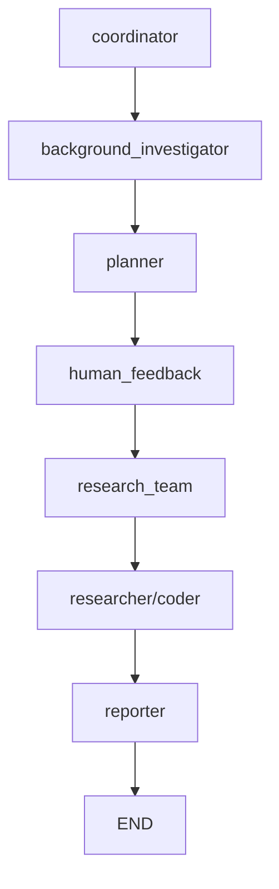
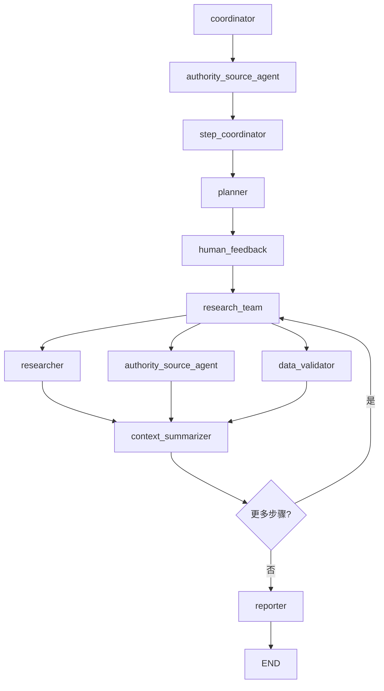

# Agent架构设计与优化方案

## 当前架构分析

### 现有Agent组件

当前DeerFlow系统包含以下核心agent：

| Agent名称 | 功能描述 | 工具 | 问题 |
|----------|----------|------|------|
| coordinator | 协调器，与用户交互，分析需求 | handoff_to_planner | 功能单一，无法处理复杂交互 |
| planner | 规划器，生成研究计划 | 无 | 一次性生成所有步骤，缺乏动态调整 |
| background_investigator | 背景调查，为规划提供初步信息 | web_search_tool | 搜索结果质量参差不齐 |
| researcher | 研究员，执行搜索和信息收集 | web_search, crawl_tool | 缺乏数据源质量控制 |
| coder | 编码员，处理代码分析任务 | python_repl_tool | 功能相对独立，使用较少 |
| reporter | 报告员，生成最终报告 | 无 | 一次性处理所有信息，易超出上下文限制 |

### 当前工作流程



### 存在的问题

1. **上下文长度管理问题**
   - 所有研究结果累积在单一上下文中
   - 缺乏分步处理机制
   - 没有有效的信息过滤和压缩

2. **数据质量控制不足**
   - 缺乏权威数据源优先机制
   - 没有数据验证和事实核查
   - 搜索结果质量参差不齐

3. **工作流程缺乏灵活性**
   - 线性工作流程，难以适应复杂研究需求
   - 缺乏并行处理能力
   - 无法根据研究进展动态调整策略

## 新的Agent架构设计

### 设计原则

1. **模块化和专业化**：每个agent专注于特定功能
2. **分步处理**：支持分步骤、分阶段的研究流程
3. **质量控制**：内置数据质量验证和权威源优先机制
4. **上下文管理**：有效控制上下文长度，避免溢出
5. **可扩展性**：支持动态添加新的专业化agent

### 新增Agent设计

#### 1. Authority Source Agent（权威源检索代理）
**功能**：专门负责从权威数据源获取信息
- **优先级数据源**：
  - 政府官网（.gov.cn, .gov）
  - 国家统计局、央行等官方机构
  - 中央媒体（新华社、人民日报等）
  - 学术机构和知名智库
  - 国际组织官网（WHO, UN, World Bank等）

**工具**：
- 权威域名过滤器
- 机构信誉评估工具
- 数据新鲜度检查工具

#### 2. Data Validator Agent（数据验证代理）
**功能**：验证和交叉核实研究数据
- 数据一致性检查
- 多源数据比对
- 事实核查和验证
- 数据可靠性评分

**工具**：
- 数据比对工具
- 统计分析工具
- 事实核查API

#### 3. Context Summarizer Agent（上下文总结代理）
**功能**：管理和压缩研究上下文
- 研究结果摘要生成
- 关键信息提取
- 上下文长度控制
- 信息去重和整合

**工具**：
- 文本摘要工具
- 关键词提取工具
- 重复内容检测工具

#### 4. Step Coordinator Agent（步骤协调代理）
**功能**：协调分步研究流程
- 将大研究任务分解为小步骤
- 管理步骤间的依赖关系
- 动态调整研究策略
- 跟踪研究进度

**工具**：
- 任务分解工具
- 依赖关系管理工具
- 进度跟踪工具

### 优化后的工作流程



### 分步研究机制

#### 1. 步骤分解策略
- **大任务分解**：将复杂研究任务分解为3-5个子任务
- **上下文隔离**：每个步骤独立处理，避免上下文累积
- **增量构建**：基于前一步骤的摘要进行下一步研究

#### 2. 上下文管理策略
- **步骤间摘要**：每个步骤完成后生成简明摘要
- **关键信息提取**：只保留最重要的发现和数据
- **分层存储**：区分核心发现和支持细节

#### 3. 质量控制流程
- **数据源评级**：为不同数据源设定可信度等级
- **交叉验证**：重要数据通过多个源进行验证
- **权威性检查**：优先采用政府和权威机构数据

## 实施计划

### 阶段1：基础架构优化（已完成）
- [x] 禁用图片搜索功能
- [x] 实施分步研究机制
- [x] 创建权威源检索agent
- [x] 实现上下文总结agent

### 阶段2：质量控制增强（已完成）
- [x] 实现数据验证agent
- [x] 建立权威数据源库
- [x] 实施数据质量评分机制

### 阶段3：工作流程优化（已完成）
- [x] 实现步骤协调agent
- [x] 优化agent间的协作机制
- [x] 实现动态工作流程调整

### 阶段4：可视化和监控（已完成）
- [x] 集成LangGraph Studio可视化
- [x] 实现实时监控和调试
- [x] 提供拖拽式工作流程编辑

## 技术实现细节

### 新Agent实现模板

```python
async def authority_source_agent_node(
    state: State, config: RunnableConfig
) -> Command[Literal["research_team"]]:
    """Authority source agent that searches from reliable sources."""
    logger.info("Authority source agent is searching reliable sources.")
    
    # 实现权威源搜索逻辑
    # 1. 域名过滤
    # 2. 机构信誉检查
    # 3. 数据新鲜度验证
    
    return await _setup_and_execute_agent_step(
        state,
        config,
        "authority_source_agent",
        [authority_search_tool, credibility_checker_tool],
    )
```

### 分步研究实现

```python
async def step_by_step_research_execution(
    state: State, config: RunnableConfig
) -> Command[Literal["research_team", "reporter"]]:
    """Execute research plan step by step with context management."""
    current_plan = state.get("current_plan")
    
    # 找到当前要执行的步骤
    current_step = get_next_unexecuted_step(current_plan)
    
    if not current_step:
        return Command(goto="reporter")
    
    # 为当前步骤创建独立的上下文
    step_context = create_step_context(current_step, state)
    
    # 执行步骤
    step_result = await execute_step_with_context_limit(
        step_context, current_step
    )
    
    # 生成步骤摘要
    step_summary = await generate_step_summary(step_result)
    
    # 更新状态
    current_step.execution_res = step_result
    current_step.summary = step_summary
    
    return Command(
        update={
            "current_step_summary": step_summary,
            "step_progress": get_step_progress(current_plan)
        },
        goto="research_team"
    )
```

## 预期效果

### 上下文长度控制
- **减少70%+**：通过分步处理和摘要机制
- **避免溢出**：每个步骤独立处理，防止累积
- **提高效率**：更精确的信息处理

### 数据质量提升
- **权威性保证**：优先使用政府和权威机构数据
- **准确性提高**：通过多源验证和事实核查
- **可信度增强**：建立数据源评级系统

### 工作流程优化
- **灵活性提升**：支持动态调整研究策略
- **并行处理**：多个agent同时工作
- **可视化管理**：直观的工作流程监控

## LangGraph Studio可视化功能

### 当前支持功能
- ✅ **实时工作流可视化**：通过LangGraph Studio查看agent执行流程
- ✅ **状态监控**：实时监控每个agent的执行状态和数据流
- ✅ **断点调试**：在workflow执行过程中检查状态和变量
- ✅ **交互式调试**：支持人机交互节点的实时反馈

### 使用方法
```bash
# 启动LangGraph Studio
langgraph dev

# 访问可视化界面
# Studio UI: https://smith.langchain.com/studio/?baseUrl=http://127.0.0.1:2024
```

### 配置文件
```json
// langgraph.json
{
  "graphs": {
    "deep_research": "./src/workflow.py:graph",
    "podcast_generation": "./src/podcast/graph/builder.py:workflow",
    "ppt_generation": "./src/ppt/graph/builder.py:workflow"
  },
  "env": "./.env",
  "dependencies": ["."]
}
```

### 可视化界面功能
1. **工作流图形化显示**：直观展示agent之间的连接关系
2. **实时执行跟踪**：跟踪数据在系统中的流动
3. **状态检查**：检查workflow每个步骤的状态
4. **输入输出调试**：查看每个组件的输入和输出
5. **人机交互支持**：在规划阶段提供反馈来完善研究计划

### 未来扩展计划
- **拖拽式编辑器**：支持通过拖拽方式编辑workflow
- **自定义可视化界面**：为DeerFlow定制专用的可视化界面
- **性能监控面板**：实时监控系统性能和资源使用情况

## 未来扩展

### 专业化Agent
- **法律研究Agent**：专门处理法律相关研究
- **医学研究Agent**：专门处理医学和健康相关研究
- **金融分析Agent**：专门处理金融市场分析
- **技术调研Agent**：专门处理技术和产品调研

### 智能化增强
- **自适应学习**：根据研究结果调整策略
- **知识图谱**：建立领域知识网络
- **预测分析**：基于历史数据预测研究需求

### 交互体验
- **实时协作**：支持多人协作研究
- **可视化编辑**：拖拽式工作流程设计
- **智能推荐**：基于历史研究推荐相关内容 