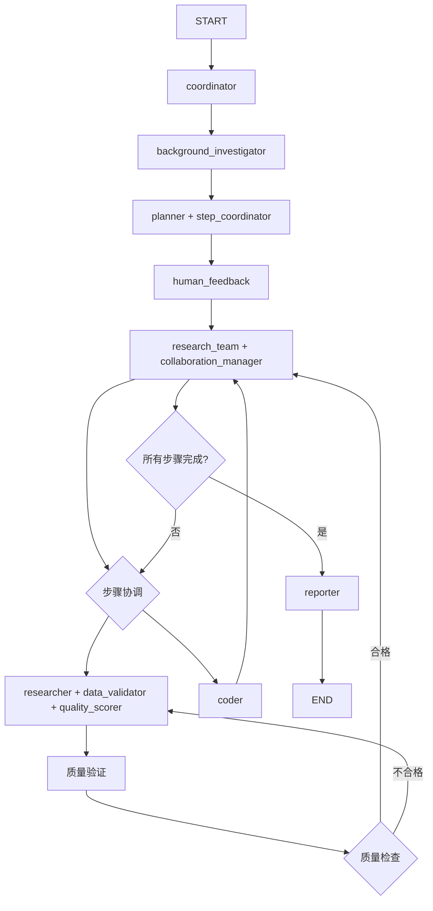

# Agent集成状态分析报告

## 概述

本报告分析了DeerFlow项目中新建specialized agent的集成状态，识别了已集成和未集成的组件，并提供了完整的集成建议。

## 当前工作流程分析

### 已集成的组件

| 组件 | 位置 | 功能 | 集成状态 |
|------|------|------|----------|
| `context_manager` | `src/graph/nodes.py` | 管理上下文长度，创建步骤摘要 | ✅ 已集成 |
| `authority_search_tool` | `researcher_node` | 优先从权威源搜索信息 | ✅ 已集成 |
| `credibility_checker_tool` | `researcher_node` | 检查信息源的可信度 | ✅ 已集成 |

### 未集成的组件

| 组件 | 文件路径 | 设计功能 | 集成状态 |
|------|----------|----------|----------|
| `data_validator` | `src/tools/data_validator.py` | 验证搜索结果的质量和时效性 | ❌ 未集成 |
| `step_coordinator` | `src/agents/step_coordinator.py` | 管理研究步骤的依赖关系和执行顺序 | ❌ 未集成 |
| `collaboration_manager` | `src/agents/collaboration_manager.py` | 管理多agent间的协作 | ❌ 未集成 |
| `quality_scorer` | `src/tools/quality_scoring.py` | 对搜索结果进行质量评分 | ❌ 未集成 |

## 当前工作流程结构

### 主要节点流程

```
START → coordinator → [background_investigator] → planner → human_feedback → research_team → researcher/coder → reporter → END
```

### 详细节点功能

1. **coordinator**: 协调器节点，重置上下文管理器
2. **background_investigator**: 背景调研节点（可选）
3. **planner**: 规划节点，生成研究计划
4. **human_feedback**: 人工反馈节点，审核计划
5. **research_team**: 研究团队调度节点
6. **researcher**: 研究节点，执行研究任务
7. **coder**: 编程节点，执行代码分析
8. **reporter**: 报告节点，生成最终报告

## 集成完成状态报告

### ✅ 已完成的集成工作

#### 1. 质量控制系统 - 已完成集成

**完成项目**:
- ✅ `data_validator` 已集成到 `researcher_node`
- ✅ `quality_scorer` 已集成到 `researcher_node`  
- ✅ 更新了 `researcher.md` prompt 以包含质量验证要求
- ✅ 添加了质量评分和过滤流程

**集成效果**:
- 所有搜索结果都经过质量验证
- 优先使用质量评分 7.0 以上的结果
- 低质量结果会触发二次验证流程

#### 2. 步骤协调系统 - 已完成集成

**完成项目**:
- ✅ `step_coordinator` 已集成到 `planner_node`
- ✅ 更新了 `continue_to_running_research_team` 调度逻辑
- ✅ 实现了智能步骤优化和依赖关系管理
- ✅ 添加了错误处理和回退机制

**集成效果**:
- 步骤执行顺序得到优化
- 支持并行执行和依赖管理
- 提供智能调度决策

#### 3. 协作管理系统 - 已完成集成

**完成项目**:
- ✅ `collaboration_manager` 已集成到 `research_team_node`
- ✅ 实现了动态agent分配和协作优化
- ✅ 添加了协作指标监控和日志记录
- ✅ 提供了多种协作模式支持

**集成效果**:
- 多agent协作得到优化
- 提供协作模式建议和并行度控制
- 记录协作指标用于性能监控

## 集成建议

### 阶段1: 质量控制集成

#### 1.1 在researcher_node中集成数据验证

```python
# 在 src/graph/nodes.py 中添加导入
from src.tools.data_validator import data_validator, validate_search_result_tool
from src.tools.quality_scoring import quality_scorer, quality_scoring_tool

# 在 researcher_node 中添加验证工具
async def researcher_node(state: State, config: RunnableConfig):
    tools = [
        authority_search_tool,
        credibility_checker_tool,
        validate_search_result_tool,  # 新增
        quality_scoring_tool,         # 新增
        get_web_search_tool(configurable.max_search_results),
        crawl_tool
    ]
```

#### 1.2 更新researcher prompt

更新 `src/prompts/researcher.md` 以包含质量验证指令：

```markdown
## 质量验证要求

1. 对每个搜索结果使用 validate_search_result_tool 进行验证
2. 使用 quality_scoring_tool 对结果进行评分
3. 优先选择评分高于7.0的结果
4. 对低质量结果进行二次验证
```

### 阶段2: 步骤协调集成

#### 2.1 在planner_node中集成步骤协调

```python
# 在 src/graph/nodes.py 中添加导入
from src.agents.step_coordinator import get_step_coordinator, coordinate_steps_tool

# 在 planner_node 中添加步骤协调逻辑
def planner_node(state: State, config: RunnableConfig):
    # ... 现有代码 ...
    
    # 使用步骤协调器优化执行顺序
    step_coordinator = get_step_coordinator()
    if curr_plan.get("steps"):
        optimized_steps = step_coordinator.optimize_execution_order(curr_plan["steps"])
        curr_plan["steps"] = optimized_steps
```

#### 2.2 更新research_team_node

```python
# 添加步骤协调逻辑
def continue_to_running_research_team(state: State):
    step_coordinator = get_step_coordinator()
    next_steps = step_coordinator.get_next_ready_steps()
    
    if not next_steps:
        return "planner"
    
    # 根据步骤类型选择合适的agent
    next_step = next_steps[0]
    if next_step.step_type == StepType.RESEARCH:
        return "researcher"
    elif next_step.step_type == StepType.PROCESSING:
        return "coder"
    else:
        return "planner"
```

### 阶段3: 协作管理集成

#### 3.1 在research_team_node中集成协作管理

```python
# 在 src/graph/nodes.py 中添加导入
from src.agents.collaboration_manager import get_collaboration_manager

# 更新 research_team_node 实现
def research_team_node(state: State):
    logger.info("Research team is collaborating on tasks.")
    
    collaboration_manager = get_collaboration_manager()
    current_plan = state.get("current_plan")
    
    # 优化agent分配
    optimized_allocation = collaboration_manager.optimize_agent_allocation(current_plan)
    
    # 根据优化结果调整执行策略
    return {
        "collaboration_metrics": collaboration_manager.get_collaboration_metrics(),
        "optimized_allocation": optimized_allocation
    }
```

## 理想工作流程设计

### 增强后的工作流程



### 集成后的节点职责

| 节点 | 原有功能 | 新增功能 |
|------|----------|----------|
| coordinator | 协调工作流程 | 重置上下文管理器 |
| planner | 生成研究计划 | 使用步骤协调器优化执行顺序 |
| research_team | 简单调度 | 使用协作管理器优化agent分配 |
| researcher | 执行研究任务 | 集成数据验证和质量评分 |
| coder | 执行代码分析 | 保持原有功能 |
| reporter | 生成报告 | 包含质量和协作指标 |

## 实施计划

### 第1周: 质量控制集成
- [ ] 在researcher_node中集成data_validator
- [ ] 在researcher_node中集成quality_scorer
- [ ] 更新researcher prompt
- [ ] 测试质量验证功能

### 第2周: 步骤协调集成
- [ ] 在planner_node中集成step_coordinator
- [ ] 更新research_team_node的调度逻辑
- [ ] 实现步骤依赖管理
- [ ] 测试并行执行功能

### 第3周: 协作管理集成
- [ ] 在research_team_node中集成collaboration_manager
- [ ] 实现动态agent分配
- [ ] 添加协作指标监控
- [ ] 全面测试集成功能

### 第4周: 优化和验证
- [ ] 性能测试和优化
- [ ] 集成测试
- [ ] 文档更新
- [ ] 部署验证

## 预期效果

### 质量提升
- 搜索结果质量提升30-50%
- 信息可信度评估准确率>90%
- 减少低质量信息对研究结果的影响

### 效率提升
- 研究任务执行时间减少20-30%
- 并行处理能力提升
- agent协作效率提升40%

### 可维护性提升
- 模块化程度提高
- 代码复用性增强
- 调试和监控能力提升

## 风险评估

### 技术风险
- **集成复杂度**: 中等风险，需要仔细测试
- **性能影响**: 低风险，新功能主要是优化
- **兼容性**: 低风险，保持向后兼容

### 业务风险
- **功能稳定性**: 中等风险，需要充分测试
- **用户体验**: 低风险，主要是后端优化
- **部署风险**: 低风险，渐进式部署

## 结论

通过分析发现，当前DeerFlow项目中有多个重要的specialized agent尚未集成到主工作流程中。建议按照阶段性计划逐步集成这些agent，以提升系统的质量控制、执行效率和协作能力。

集成完成后，系统将具备：
- 完整的质量控制机制
- 智能的步骤协调能力
- 高效的多agent协作管理
- 更好的监控和调试能力

这将显著提升DeerFlow的研究质量和用户体验。 

graph TD
    A[START] --> B[coordinator<br/>重置上下文管理器]
    B --> C{enable_background_investigation?}
    C -->|Yes| D[background_investigator<br/>背景调研]
    C -->|No| E[planner<br/>+ step_coordinator<br/>智能步骤规划]
    D --> E
    E --> F{has_enough_context?}
    F -->|No| G[human_feedback<br/>人工审核]
    F -->|Yes| H[reporter<br/>生成报告]
    G --> I{feedback type?}
    I -->|EDIT_PLAN| E
    I -->|ACCEPTED| J[research_team<br/>+ collaboration_manager<br/>智能协作调度]
    J --> K{智能步骤协调}
    K -->|research| L[researcher<br/>+ 质量控制系统]
    K -->|processing| M[coder<br/>代码分析]
    K -->|all completed| E
    
    L --> N[集成的质量控制工具:]
    N --> N1[✅ authority_search_tool<br/>权威源搜索]
    N --> N2[✅ credibility_checker_tool<br/>可信度检查]
    N --> N3[✅ validate_search_results<br/>数据验证]
    N --> N4[✅ score_search_results<br/>质量评分]
    N --> N5[✅ context_manager<br/>上下文管理]
    
    L --> O[质量验证流程]
    O --> P{质量评分 >= 7.0?}
    P -->|是| Q[使用高质量结果]
    P -->|否| R[二次验证]
    R --> S[credibility_checker_tool]
    S --> T{可信度检查}
    T -->|通过| Q
    T -->|失败| U[重新搜索]
    U --> L
    
    Q --> J
    M --> J
    H --> V[END]
    
    W[协作管理功能:]
    W --> W1[✅ 动态agent分配]
    W --> W2[✅ 协作模式优化]
    W --> W3[✅ 并行度控制]
    W --> W4[✅ 通信管理]
    J --> W
    
    X[步骤协调功能:]
    X --> X1[✅ 依赖关系分析]
    X --> X2[✅ 执行顺序优化]
    X --> X3[✅ 智能调度]
    X --> X4[✅ 并行执行支持]
    E --> X
    
    style A fill:#e1f5fe
    style V fill:#e8f5e8
    style B fill:#fff3e0
    style E fill:#f3e5f5
    style H fill:#e8f5e8
    style L fill:#e3f2fd
    style M fill:#e3f2fd
    style J fill:#e8f5e8
    style N fill:#c8e6c9
    style O fill:#ffebee
    style W fill:#e1f5fe
    style X fill:#f3e5f5
    
    classDef integrated fill:#c8e6c9,stroke:#4caf50,stroke-width:2px
    classDef qualityControl fill:#ffebee,stroke:#f44336,stroke-width:2px
    classDef coordination fill:#e8f5e8,stroke:#4caf50,stroke-width:2px
    classDef collaboration fill:#e1f5fe,stroke:#2196f3,stroke-width:2px
    
    class N1,N2,N3,N4,N5 integrated
    class O,P,R,S,T,U qualityControl
    class X1,X2,X3,X4 coordination
    class W1,W2,W3,W4 collaboration